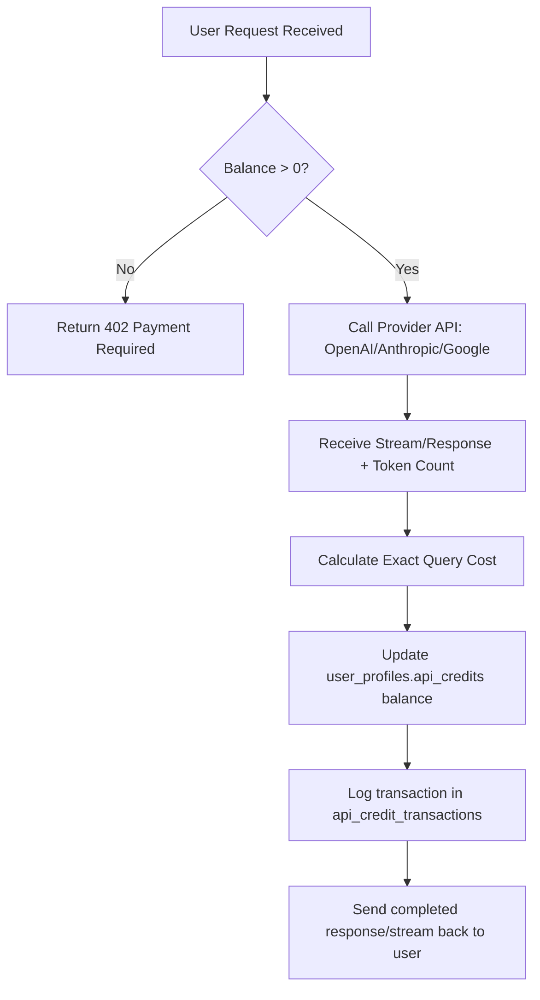

# Monetization & Managed Credit System Plan

This document outlines the strategic design, technical architecture, and implementation plan for monetizing Flowr using a **managed credit subscription model** instead of a Bring Your Own Key (BYOK) setup.

---

## 1. Business & Pricing Model

*   **Monthly Subscription:** $20.00 / month.
*   **User Credit Pool:** $15.00 worth of direct API credits loaded per billing cycle (non-cumulative; resets to $15.00 each month).
*   **Platform Margin:** $5.00 / month per user kept for infrastructure, database hosting, domain maintenance, and profits.
*   **Overage/Top-Ups:** One-time credit additions (e.g., $5.00 or $10.00) available when a user exhausts their monthly pool.

### The Margin Economics
*   **Casual Users:** Typically use less than 20% of their credits. For these users, your effective margin increases (e.g., you keep $18+ out of the $20).
*   **Power Users:** Hard-capped at their $15.00 pool. When they hit $0.00, their access is paused until they pay for a top-up, protecting the platform from massive API bills.

---

## 2. Simplified Dual-Model Architecture

Instead of exposing complex router matrix configurations to the subscriber, the system is simplified into two modes:

| Mode | Target Model | API Cost Profile (Input/Output per 1M tokens) | Ideal Use Case |
|---|---|---|---|
| **Regular** | GPT-4o-mini / Gemini 2.0 Flash-Lite | ~$0.15 / ~$0.60 | Fast notes editing, basic outline generation, simple organization |
| **Complex** | Claude 3.5 Sonnet / Gemini 1.5 Pro | ~$3.00 / ~$15.00 | Deep coding tasks, code export, advanced canvas logic/reasoning |

---

## 3. Database Schema changes (Supabase)

To track credits and usage in real-time, the database will require balance fields and transaction logging.

```sql
-- Step 1: Add balance tracking to user profiles/workspaces
ALTER TABLE user_profiles 
ADD COLUMN api_credits NUMERIC(10, 4) DEFAULT 0.0000;

-- Step 2: Transaction log for auditing token usage and payments
CREATE TABLE IF NOT EXISTS api_credit_transactions (
  id UUID PRIMARY KEY DEFAULT gen_random_uuid(),
  user_id UUID NOT NULL REFERENCES auth.users(id) ON DELETE CASCADE,
  amount NUMERIC(10, 4) NOT NULL, -- Negative for queries, positive for subscriptions/top-ups
  transaction_type TEXT NOT NULL CHECK (transaction_type IN ('query_cost', 'subscription_allocation', 'one_time_topup')),
  model_id TEXT,
  tokens_input INT DEFAULT 0,
  tokens_output INT DEFAULT 0,
  created_at TIMESTAMPTZ DEFAULT now()
);

-- Index for fast user balance checks
CREATE INDEX idx_credit_transactions_user ON api_credit_transactions(user_id);
```

---

## 4. API Request & Metering Lifecycle

For every chat or canvas agent interaction, the backend routes must execute the following lifecycle:



### Cost Calculation Logic
```typescript
interface ModelRate {
  inputRate: number;  // Cost per token (e.g., 0.000003 for Claude 3.5 Sonnet input)
  outputRate: number; // Cost per token (e.g., 0.000015 for Claude 3.5 Sonnet output)
}

const RATES: Record<string, ModelRate> = {
  'gpt-4o-mini': { inputRate: 0.15 / 1000000, outputRate: 0.60 / 1000000 },
  'claude-3-5-sonnet': { inputRate: 3.00 / 1000000, outputRate: 15.00 / 1000000 }
};

function calculateCost(modelId: string, inputTokens: number, outputTokens: number): number {
  const rate = RATES[modelId] || RATES['gpt-4o-mini'];
  return (inputTokens * rate.inputRate) + (outputTokens * rate.outputRate);
}
```

---

## 5. Stripe Billing Integration

1. **Stripe Checkout Portal:** Integrates with the application settings to allow users to subscribe.
2. **Stripe Webhooks:**
    *   `invoice.paid` / `checkout.session.completed`: When a subscription succeeds, trigger a database function that updates `api_credits = 15.00`.
    *   `customer.subscription.deleted`: Set `api_credits = 0.00`.
3. **One-Time Payments:** Allow users to buy $5.00 or $10.00 credit packets. When a session is completed, add that amount directly to their current balance: `api_credits = api_credits + topup_amount`.

---

## 6. Phase-by-Phase Roadmap

### **Phase 1: Database & Backend Prep**
*   Run the migration to create `api_credit_transactions` and the `api_credits` balance column.
*   Update `chainRouter.ts` or API routes to calculate and deduct token costs from the balance after each successful call.
*   Create a mock billing mode where you manually adjust credit values via the DB to test the lockout flow.

### **Phase 2: Billing & Subscriptions**
*   Create a Stripe account and define the $20.00/month recurring product and $5.00/$10.00 top-up items.
*   Implement Next.js API routes for Stripe Checkout and webhook handling.
*   Build the frontend Subscription modal to show remaining credits, usage indicators, and purchase options.

### **Phase 3: Router Simplification**
*   Clean up the settings panel to remove complex multi-model configurations.
*   Set up a toggle in the UI: **⚡ Fast (Regular)** or **🧠 Intelligent (Complex)**.
*   Map all chat/canvas backend triggers strictly to these two modes.
